# 🚀 Resume Genie

<div align="center">


**Your all-in-one AI-powered career toolkit — built with Grok-4 & Streamlit**

[](https://python.org)
[](https://streamlit.io)
[](https://x.ai)
[](https://langchain.com)
[](LICENSE)

</div>

---

## ✨ Features

Resume Genie is a multi-tool Streamlit application that leverages **Grok-4 (xAI)** to supercharge your job application process. Switch between 4 powerful AI tools in seconds using the sidebar.

| Tool | Description |
|------|-------------|
| ✉️ **Cover Letter Generator** | Tailors a professional 300–450 word cover letter to match your resume with any job description |
| 📊 **Resume-JD Matcher** | Scores how well your resume matches a job description with keyword analysis, ATS compatibility & skill gaps |
| 🔍 **Resume Checker** | Standalone resume evaluation — clarity, format, ATS-readiness, strengths, and career next steps |
| 💬 **Career Coach Chat** | Interactive chatbot grounded in your resume for career advice, interview prep & strategy |

---

## 🖥️ Demo

```
📄 Upload your resume PDF
📋 Paste the job description
🤖 Let Grok-4 do the magic
```

---

## 🛠️ Tech Stack

- **[Streamlit](https://streamlit.io)** — UI framework
- **[LangChain (xAI)](https://python.langchain.com)** — LLM orchestration via `langchain-xai`
- **[Grok-4 by xAI](https://x.ai)** — Underlying large language model
- **[PyPDFLoader](https://python.langchain.com/docs/integrations/document_loaders/pypdf/)** — PDF parsing
- **[Pillow](https://pillow.readthedocs.io)** — Logo/image rendering

---

## 📦 Installation

### 1. Clone the repository

```bash
git clone https://github.com/your-username/resume-genie.git
cd resume-genie
```

### 2. Install dependencies

```bash
pip install -r requirements.txt
```

### 3. Set up your xAI API key

Create a `.streamlit/secrets.toml` file:

```toml
XAI_API_KEY = "your_xai_api_key_here"
```

Or export it as an environment variable:

```bash
export XAI_API_KEY="your_xai_api_key_here"
```

> 🔑 Get your API key from [console.x.ai](https://console.x.ai)

### 4. Run the app

```bash
streamlit run main_dashboard.py
```

---

## 📁 Project Structure

```
resume-genie/
├── main_dashboard.py       # Main Streamlit app
├── logo.png                # App logo (shown in sidebar)
├── requirements.txt        # Python dependencies
├── .streamlit/
│   └── secrets.toml        # API keys (do NOT commit this!)
└── README.md
```

---

## 📋 Requirements

```txt
streamlit
langchain-xai
langchain-community
langchain-core
pypdf
pillow
```

> Save the above as `requirements.txt` in your project root.

---

## 🔒 Security Note

> ⚠️ **Never hardcode your API key** in `main_dashboard.py`. Always use `.streamlit/secrets.toml` or environment variables. Add `secrets.toml` to `.gitignore`.

```gitignore
# .gitignore
.streamlit/secrets.toml
__pycache__/
*.pyc
```

---

## 🧠 How It Works

```mermaid
flowchart LR
    A[📄 Upload Resume PDF] --> B[PyPDFLoader]
    B --> C[Extracted Text]
    D[📋 Job Description] --> E[LangChain Prompt]
    C --> E
    E --> F[Grok-4 via xAI API]
    F --> G[✅ Structured Output]
    G --> H[Streamlit UI]
```



1. User uploads a **PDF resume** → text is extracted via `PyPDFLoader`
2. User provides a **job description** (for relevant tools)
3. Text is injected into **carefully crafted LangChain prompts**
4. **Grok-4** generates the output (streamed in real-time for cover letters)
5. Results are displayed with **Markdown formatting** and download options

---

## 💡 Tool Details

### ✉️ Cover Letter Generator
- Streams output token-by-token for a real-time feel
- Generates a structured, professional letter (300–450 words)
- Download result as a `.md` file

### 📊 Resume-JD Matcher
- Returns **Score out of 100**, **Overall Match %**
- Lists matched & missing keywords
- ATS Compatibility Score, Readability Score
- Skill gap analysis and improvement suggestions

### 🔍 Resume Checker
- Standalone evaluation (no JD needed)
- Strengths, weaknesses, skills mentioned
- Recommended skills & next career steps

### 💬 Career Coach Chat
- Full conversational memory via `st.session_state`
- Resume context injected as system message
- Streams responses for natural conversation feel

---

## 🙌 Contributing

Pull requests are welcome! For major changes, please open an issue first to discuss what you'd like to change.

1. Fork the repo
2. Create your feature branch: `git checkout -b feature/amazing-feature`
3. Commit your changes: `git commit -m 'Add amazing feature'`
4. Push to the branch: `git push origin feature/amazing-feature`
5. Open a Pull Request

---

## 📅 Built With ❤️

> **Author**: Venkatesh  
> **Built**: february 2026  
> **Powered by**: [xAI Grok-4](https://x.ai)

---

<div align="center">

⭐ **Star this repo if you found it useful!** ⭐

</div># Resume-Genie
